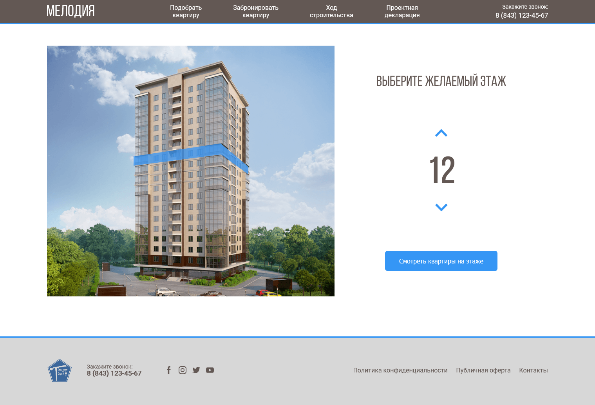
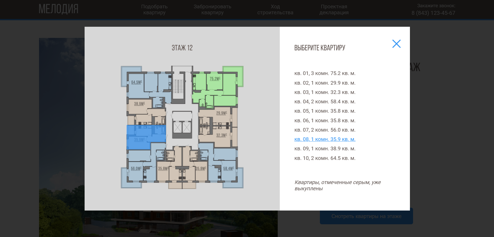

# Residential complex
Layout project of a residential complex for portfolio.

## Demo:
- [LINK TO DEMO](https://paaavuk.github.io/residential-complex/dist/index.html)

## Screenshoots:
</img>
</img> 

## Used technologies:
1. HTML5 (semantic valid, BEM methodology naming)
2. SCSS (build with, compiled to CSS3)
3. JQuery (to interact with items on the page)
4. SVG (graphic elements for choosing floors in the house and apartments on the floor)
5. Parcel bundler (gathered everything together)
